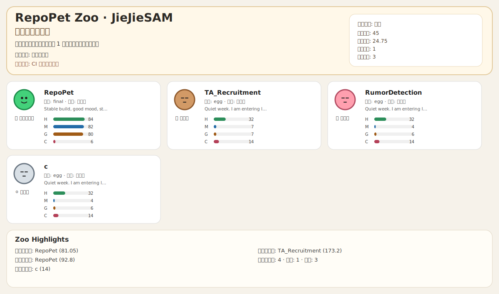
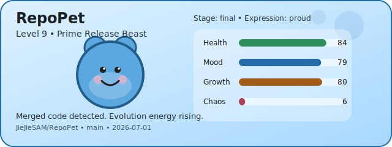

# RepoPet Zoo 🐾

把 GitHub 仓库养成一座会“呼吸”的宠物动物园。  
RepoPet 会读取仓库活动，按**确定性规则**计算宠物状态，生成可直接展示在 README 的 SVG 卡片与账号总览看板。

## 1. Zoo Dashboard（账号动物园总览）🦁

<!-- REPOPET_ZOO:START -->

你的 GitHub 账号正在运行一座仓库宠物动物园：上方是账号人格，中间是仓库宠物墙，下方是亮点排行。
<!-- REPOPET_ZOO:END -->

## 2. 单仓宠物卡（兼容 v1）🐣

<!-- REPOPET:START -->

This repository has a living digital pet that evolves from project activity.
<!-- REPOPET:END -->

## 3. 这个项目能做什么

- 把仓库活跃度转成“宠物状态”而不是冷冰冰图表
- 生成机器可读 JSON，便于排查与二次开发
- 生成轻量 SVG，可直接嵌入 GitHub README
- 同时支持：
  - 单仓模式（v1）
  - 账号动物园模式（v2）
- 所有规则可配置、可测试、可复现（同样输入 => 同样输出）

## 4. 核心玩法 / 双模式

### 模式 A：单仓模式（Single Repo）

输入：
- `GITHUB_REPOSITORY=owner/repo`

输出：
- `data/pet-state.json`
- `assets/repopet.svg`
- README 中 `REPOPET` 区块

适合：
- 项目仓库本身展示“仓库宠物状态”

### 模式 B：账号动物园模式（Account Zoo）

输入：
- `GITHUB_OWNER=owner`

输出：
- `data/account-summary.json`
- `assets/zoo-dashboard.svg`

适合：
- GitHub Profile / 作品集仓库展示“账号级开发人格与仓库群状态”

## 5. 四维属性怎么计算

RepoPet 使用 4 个核心属性驱动宠物表现：

- `health`（健康）：CI 成功率、问题积压、近期新鲜度
- `mood`（心情）：连续提交、近 7 天动量、合并 PR 情况
- `growth`（成长）：近 30 天累计进展 + 持续性
- `chaos`（混沌）：失败构建、bugfix 密度、波动性

这些分值都来自显式规则（见 `src/domain/config/scoringRules.ts`），范围固定在 `0-100`。

## 6. 账号人格（Persona）怎么来

账号人格不是简单平均值，而是根据多个信号做确定性判定：

- 活跃仓库数 / 冬眠仓库数
- 平均健康、情绪、成长、混沌
- 活跃度离散程度（activity spread）
- bugfix 比例
- 工作流稳定性
- 最近活动集中度

输出包括：

- `personaType`（内部类型）
- `personaTitle`（中文标题）
- `personaMood`
- `personaSummary`
- `dominantTrait`
- `warningTrait`

示例人格：
- 秩序维护者
- 深夜爆肝饲养员
- 热修补大师
- 仓库冬眠管理员
- 多线程人格分裂兽

## 7. 安装与启动

### 前置依赖

- Node.js 20+
- pnpm 10+

### 安装

```bash
pnpm install
```

## 8. 环境变量

### 必填

- `GITHUB_TOKEN`  
  GitHub API Token。公开仓库可用低权限，私有仓库需要对应读取权限。

### 单仓模式

- `GITHUB_REPOSITORY=owner/repo`

### 账号动物园模式

- `GITHUB_OWNER=owner`
- `REPOPET_INCLUDE_FORKS=false`（可选，默认 false）
- `REPOPET_INCLUDE_ARCHIVED=false`（可选，默认 false）
- `REPOPET_MAX_REPOS=12`（可选，默认 12）
- `REPOPET_SORT_BY=updated`（可选：`updated` / `pushed` / `name`）
- `REPOPET_REPO_VISIBILITY=all`（可选：`all` / `public` / `private`）

### 通用可选

- `REPOPET_DRY_RUN=true|1`  
  仅计算与打印，不落盘写文件。

## 9. 命令总览

- `pnpm generate:pet`：生成单仓宠物（真实写文件）
- `pnpm generate:pet:dry`：单仓 dry-run
- `pnpm generate:zoo`：生成账号动物园（真实写文件）
- `pnpm generate:zoo:dry`：账号动物园 dry-run
- `pnpm test`：运行测试
- `pnpm lint`：运行静态检查

## 10. GitHub Actions 自动化

工作流：`.github/workflows/update-pet.yml`

当前自动化主要用于单仓模式更新：

1. 安装依赖
2. 运行生成命令
3. 仅在产物变化时提交生成文件

你可以继续扩展为 zoo 模式专用工作流（建议独立 workflow，避免互相干扰）。

## 11. 可定制点（非常适合二开）🛠️

- 评分规则：`src/domain/config/scoringRules.ts`
- 动物园统计与人格规则：`src/domain/zoo/services/*.ts`
- 物种映射：`src/domain/zoo/speciesMapping.ts`
- 中文人格标题：`src/domain/zoo/chineseLabels.ts`
- SVG 渲染：
  - 单仓：`src/infrastructure/rendering/renderPetSvg.ts`
  - 动物园：`src/infrastructure/rendering/renderZooDashboardSvg.ts`

## 12. Roadmap（有趣但务实）🚀

- [x] 单仓宠物卡（v1）
- [x] 账号动物园看板（v2）
- [x] 账号人格推导（确定性规则）
- [ ] zoo README 自动更新块写入器
- [ ] 物种动画细节（保持 SVG 轻量前提）
- [ ] 更丰富的中文状态模板库
- [ ] 多账号对比模式（PK 赛道）

---

如果你想把 GitHub 主页变得“有生命力”，RepoPet Zoo 会是一个既好玩又能体现工程能力的展示件。✨
